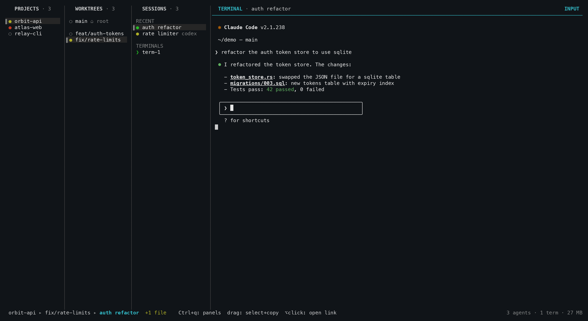

<div align="center">

# nebula

**Mission control for your coding agents.**

Run **Claude Code**, **Codex** and **Cursor** across every project and git worktree you own — from one
terminal, one keyboard, one tree. They keep working when you close it.

[](https://github.com/AgentSystemLabs/nebula/releases)
[](https://github.com/AgentSystemLabs/nebula/actions)
[](LICENSE)
[](#install)
[](https://www.rust-lang.org)

```sh
curl -fsSL https://raw.githubusercontent.com/AgentSystemLabs/nebula/main/install.sh | sh
```



</div>

---

## Why nebula

You start three agents in three terminal tabs. Five minutes later you have no idea which one is waiting
on a permission prompt, which one finished, and which one is still thinking — so you tab through all
three, every time, and read the screens.

nebula replaces that with a tree and a color:

- **Every project, worktree and agent in one list.** Up to four columns, `h`/`j`/`k`/`l` to move, `Enter` to drill in.
- **Lists that order themselves.** Projects, worktrees and sessions all sit most-recent-first, with a dim
  `23m ago` after the name saying why the row is where it is: a session is stamped when it last did
  anything, a worktree carries the newest stamp of its sessions, a project the newest of its worktrees.
  Nothing is pinned or dragged into place by hand.
- **A dot per session that says what it's doing.** ● yellow is mid-turn, ● violet is done and waiting
  to be read, ● green is done and read, ● red wants you. Parents roll up their children, so a red dot
  on a collapsed project tells you exactly where to look without opening anything.
- **A daemon that owns the PTYs.** Quit the UI, close the laptop lid, come back tomorrow — the agents
  never stopped, and your scrollback is replayed.
- **Real git worktrees, one keystroke.** Two agents in two directories don't collide.
- **Every open pull request under them, readable in place.** Open a project and nebula asks `gh` what's
  still open on the repo. Hover one to read its description and comments in the pane, `g` for its diff,
  `Enter` for the browser, or `n` for a Claude SESSION scoped to that PR.

No Electron, no server, no MCP. One ~4 MB Rust binary and a unix socket.

## Install

macOS or Linux — the same command installs and updates:

```sh
curl -fsSL https://raw.githubusercontent.com/AgentSystemLabs/nebula/main/install.sh | sh
```

It downloads the prebuilt binary for your platform from the latest GitHub release into `~/.local/bin`
(override with `NEBULA_INSTALL_DIR`), falling back to `cargo install --git` when no release matches.

Afterwards, `nebula upgrade` runs that same script for you. It refuses to clobber a local `cargo build`
(pass `--force` if you mean it). Upgrading while a daemon is running is safe: sessions keep running on
the old binary until you `nebula kill` and relaunch.

> **Prerequisite:** at least one agent CLI on your `PATH` — `claude`, `codex`, or `cursor-agent`.
> nebula spawns them; it doesn't ship them.

## Quickstart

**1. Add a repo.** nebula is project-first, and a project is just a git checkout:

```sh
nebula add ~/code/my-app       # or, from inside the repo: nebula add .
```

**2. Open the TUI.** A bare `nebula` launches it and auto-starts the daemon:

```sh
nebula
```

Up to four columns, left to right: **Projects → Worktrees → Sessions → Terminal**. `Tab` / `Shift+Tab` (or
`h` / `l`, or `←` / `→`) move focus between columns, `j` / `k` move the selection inside one, and `Enter`
drills in. `Tab` stops at the TERMINAL PANE rather than wrapping back round to the first visible panel,
and `Shift+Tab` stops at the first visible panel rather than wrapping into the pane. Neither direction
cycles. Landing on a
live pane hands it the keyboard, so `Tab` all the way right and start typing at the agent.
`Shift+P` shows or hides the PROJECTS PANEL and `Shift+B` does the same for the WORKTREES PANEL. Each
toggle is independent, the TERMINAL PANE takes the released width, and showing a panel restores its
remembered size without moving FOCUS.
With no projects yet you get the splash instead — press `n` to add one without leaving the TUI.

**3. Choose where the agent runs.** Select your project, then a worktree. Every project starts with one:
the checkout itself. Press `n` in the Worktrees column to branch off into a real `git worktree` (created
under `<repo>/../<repo-name>-worktrees/<branch>`). That's the point of the column — two agents in two
worktrees edit two directories and never collide. Or skip the column and just ask: tell a Claude session
"do this in a worktree" and it creates one through nebula and moves itself into it (see *How it works*).

Under the checkouts, an `OPEN PRS` group lists every pull request still open on the repo — drafts
included, badged as such — fetched with `gh` when you open the project, re-asked every 15 seconds, and
again whenever the Worktrees or Sessions panel or the terminal window takes focus (one `gh pr list` per
project, so a repo with a hundred open PRs still costs one API call). That beat is
also how rows retire: merge or close a pull request and it stops coming back, so it leaves the list on
its own, and the one under your cursor goes the moment GitHub says it's merged. Rest the cursor on one
and the right-hand pane reads it to you — description, stats and the whole conversation — without
leaving nebula; `g` opens its diff in the same viewer your worktree diffs use, `Enter` or a double-click
opens it in the browser, and `/` finds it by title. Press `n` — or choose **New Claude session** from
`m` / right-click — to start a Claude SESSION in the PROJECT's ROOT WORKTREE with an injected system
prompt that limits all work to that PR and includes its URL. The URL is kept with the AGENT, so RESUME
reapplies the same scope. Only the row you actually stop on is fetched.

**4. Start the agent.** With a worktree selected, press `n` in the Sessions column. A menu asks what to
run — **Claude**, **Codex**, or **Cursor** (a plain shell is `t`, see below); a CLI you never use can be
switched off on the settings overlay's Agents tab and drops out of the menu entirely. `→` on Claude or Codex drills
into model and reasoning-effort submenus; `Enter` anywhere takes your configured defaults. On the
Claude row, `Tab` toggles Cloud mode: after the optional name, enter the task in the wrapped editor
(`Shift+Enter` or `Ctrl+J` adds a line) and nebula launches `claude --cloud <task>`. On accounts without
Claude's live-attach rollout the CLI prints the session URL and exits — so nebula reads the session id off
that output and re-enters the session for you, without being asked. The row becomes a **mirror** of the
cloud session: nebula runs `claude --cloud <id>`, falling back to `claude --teleport <id>` (the transcript
and branch pulled into a local session) when the account can't attach, and then re-teleports every 45s so
turns the cloud agent takes keep landing in the pane. The badge reads `cloud ↻` while it is following.
Since either CLI switches the checkout to the cloud branch, a row still in the main checkout is first
re-homed into a `cloud-<id>` worktree of its own.

A teleport is a snapshot, not a live link, which is why the mirror re-pulls — and why **the first key you
type into the pane ends it**: from then on the session is yours, an ordinary local Claude that started from
a cloud transcript, and nebula stops respawning it under you. `NEBULA_CLOUD_MIRROR_SECS` changes the
cadence; `0` turns the follow off, leaving **Attach cloud session** (the row's `m` menu) as the manual
refresh. To steer the cloud agent without a browser, pick **Send to cloud session** — the same wrapped
editor — and nebula runs `claude -p <message> --cloud <id>` and pulls the transcript straight after. The
reply shows up on a later refresh; the CLI never returns one. Otherwise, name the session or accept the
default and nebula spawns the CLI in that worktree and drops you straight into it.

If you keep starting the same kind of session with the same framing, save it as an **agent preset**:
`e` in the Sessions column lists them, `a` opens a small form — name, harness, model, effort, and an
optional prefix and postfix — and `e` / `d` edit or delete. `Enter` on a preset asks for the task in the
same wrapped editor, then launches the CLI with `prefix + task + postfix` as its very first prompt, so
the agent is already working when the pane opens. The row it creates is an ordinary session: it names
itself on that first turn, resumes, and shows status like any other. Presets live in
`agent_presets.json` beside `config.json`.

**5. Leave — it keeps running.** `Ctrl+q` gets you out of the terminal and back to the panels. That's the
key to remember: the agent doesn't care that you stopped watching. Press `q` to quit nebula entirely and
the daemon still owns every PTY — come back with `nebula` an hour later and each session is where you
left it, scrollback replayed.

**6. Read the dots instead of the screens.** Once you're running more than one agent you stop reading
terminals and start reading the Sessions column. Full table under [Status dots](#status-dots).

**7. Let them name themselves.** Leave a new session on its default name and the agent retitles it after
your first prompt — `Fix Login Redirect` rather than `agent-3`. Type a name yourself (or `r` to rename)
and nebula never touches it.

From there: `t` opens a shell in the selected worktree, `/` fuzzy-jumps to any workspace, project,
worktree, session or open pull request by name — across every workspace, not just the open one, so
picking a hit somewhere else switches you there on the way — `w` switches this window's workspace when
one project list gets long (each nebula instance keeps its own — run two, on two workspaces, side by
side) and `Shift+W` shows or hides the Workspaces bar across the top, where every workspace is a tab
carrying the rolled-up status of the agents under it, `s` opens settings, `?` lists every key, and `m`
(or right-click) opens a context menu for whatever's selected.

## Status dots

| Dot | Meaning |
|---|---|
| ● gray | fresh — agent never run |
| ● yellow | running — turn in progress (Stop is gated on active subagents) |
| ● violet | done, unread — turn complete and nobody has looked at it yet |
| ● green | done, read — same finished turn, once the cursor has been on the session |
| ● red | needs feedback — permission prompt or question waiting on you |
| ● magenta | terminated — process died mid-run |
| ○ | disconnected — daemon restarted while the agent was live |

Worktree and project rows roll up their children: red beats yellow beats done, and a parent's dot is
violet whenever anything unread finished under it — so the violet walks up the tree and turns green as
you read your way down it.

A dot going violet while you were looking elsewhere is easy to miss, so nebula counts those for you:
when a running (or red) session finishes a turn that isn't in the pane on screen, its worktree and
project rows grow a violet `n done` badge — the number of terminals you have left to go read — and the
session row itself says `done` where its harness name normally sits. Walking the cursor onto a session
previews it, which reads it: the badges count down as you go and disappear at zero. The flag lives in
the daemon, so it survives closing the TUI and is shared by every client; a turn that finishes in the
pane you're already looking at never counts.

## Working a worktree

The panels aren't the only view. With a worktree selected, from any panel:

| Key | View |
|---|---|
| **`g`** | **Git diff.** Changed files down the left, the diff on the right, with a live fuzzy filter. On an open-PR row it shows that pull request's diff instead, fetched whole with `gh pr diff`. `Ctrl+r` marks a file reviewed ✓ and sinks it to the bottom — nebula-side bookkeeping only, no git state is touched — and every mark clears itself when HEAD moves or the file changes again, so what's left unticked is genuinely what you haven't read. |
| **`f`** | **Find file.** Fuzzy finder over the worktree. `Enter` opens the file in an editor modal (vim by default; the `editor` setting or `NEBULA_EDITOR` picks another), `Ctrl+y` copies the path — ready to paste into an agent. |
| **`F`** | **Find in files.** `git grep` into the same modal; `Enter` opens the hit at its line. |
| **`b`** | **File tree browser.** Tree on the left, syntax-highlighted preview on the right, and an always-live filter that narrows the tree to matching files and the directories holding them. |

nebula finds the pull request open on each branch with `gh` and shows it in the Sessions panel's
OPEN PRS group, including a count of comments that landed while you were away. Rest on that row and the
pane reads the pull request — description, stats, conversation — exactly as it does for the project-wide
OPEN PRS rows under the worktrees; `g` shows its diff. Manual link attachment is currently unavailable;
previously saved links remain visible so the change does not discard data.

## How it works

- **Detached daemon (tmux-style).** A background daemon owns every PTY, so agents keep running when
  the TUI closes; relaunch and scrollback is replayed. Worktrees are real `git worktree`s created
  under `<repo>/../<repo-name>-worktrees/<branch>`.
- **Status via agent-CLI hooks, not MCP.** nebula merges managed hooks into each agent's config;
  they report to the daemon's loopback endpoint and drive the status dots. Codex hooks live in
  `~/.codex/hooks.json` — approve them once at codex's "Hooks need review" prompt.
- **Sessions title themselves** after your first prompt (a name you type always wins), can move into
  a worktree on request ("do this in a worktree"), and can spawn siblings (`nebula spawn "<task>"`).
- **Cloud tasks are process arguments** — don't put secrets in a `claude --cloud` task description.
- **Warm-up and reaping.** Agents pre-boot while you're still naming the session; idle PTYs nobody is
  watching are reaped after `session_idle_timeout` (5m default) and resume on the next attach.
- **Settings live in `config.json`** beside the database, read fresh on each use — hand edits apply
  without a restart; `s` opens the same file as an overlay. Every panel key is rebindable in its
  Hotkeys tab (`Ctrl+q` stays hardwired so you can't trap yourself).

See [ARCHITECTURE.md](ARCHITECTURE.md) for the full picture.

## Keys

Defaults — every one of them is rebindable in Settings → Hotkeys (`s`).

<details>
<summary><b>Full keymap</b> (click to expand)</summary>

<br>

| Context | Key | Action |
|---|---|---|
| Panels | `Tab`/`Shift+Tab`, `h/l` or `←/→`, `j/k` | move FOCUS / selection through visible panels; the walk stops at both ends (`Tab` at the TERMINAL PANE, `Shift+Tab` at the first visible panel) instead of cycling, and landing on a live pane takes its input; `h`/`l` stop one short of each end, and a double tap there (`l`,`l` at Sessions, `h`,`h` at the first visible panel) jumps the boundary; so do `k`,`k` on a panel's first row (up into the workspaces bar) and `j`,`j` in the bar (back down to the panel you came from) |
| Panels | `Ctrl+→` | cross into the terminal pane *without* taking its input (`Tab`, or a double tap of `l`/`→` at Sessions, takes it) |
| Panels | `Enter` | drill in; on a session: attach |
| Any panel | `/` | fuzzy jump across every workspace, project, worktree and session — in *every* workspace, each row pathed `workspace/project/branch/session`, so typing another workspace's name jumps you into it (`Ctrl+n/p` move, `Ctrl+o` opens the hit, `Ctrl+f` just lands the selection on it) |
| Projects | `n` / `d` | add project / remove from list |
| Any panel | `o` | add ("open") a project — same prompt as `n`, from any focus |
| Add project | type + `Tab`, `↓↑` / `→` / `←` | browse for the repo: type to filter (bash-style Tab completion), arrows pick a directory, `→` steps in, `←` steps up, `Enter` adds the highlighted (or typed) path; `●` marks git repos |
| Projects | `r` | rename the row — a label, not a move: the folder on disk keeps its name and hangs off a `└` under the new one. A terminal cell has one font size (Kitty's OSC 66 renders half-size text, but WezTerm and Ghostty don't implement it), so the hierarchy is weight, opacity and position instead: the name you chose is bold, the folder is the dimmest theme color plus the faint attribute. An empty name puts the row back on the folder's name |
| Worktrees (checkout row) | `n` / `d` | new worktree / delete (typed confirm — deletes files) |
| Worktrees (PROJECT OPEN PRS row) | `n`; `m` / right-click | new Claude SESSION scoped to that PR; the context menu also opens the PR or its diff |
| New worktree | type a sentence, or `Enter` on the empty prompt | the branch name is slugified (`fix login redirect` → `fix-login-redirect`); empty takes a random `<adj>-<noun>-<verb>` |
| Sessions | `n` | new session (agent or shell terminal) |
| New session picker (Claude) | `Tab` | toggle Claude Cloud; Cloud adds a wrapped task prompt (`Shift+Enter` or `Ctrl+J` inserts a line) before launch |
| Sessions (cloud row) | `m` | **Attach cloud session** re-pulls the transcript now; **Send to cloud session** queues a message on it |
| Sessions | `r`, `a`, `u`, `d`, `A` | rename, archive, unarchive, delete, toggle archived |
| Sessions | `e` | agent presets: saved launch definitions (harness, model, effort, optional prefix/postfix text). `Enter` asks for a task and starts the agent with prefix + task + postfix as its first prompt; `a` / `e` / `d` create, edit, delete |
| Any panel | `Shift+D` | delete every row of the focused panel (confirm lists the casualties) |
| Any panel | `g` | git diff for the selected worktree: filter, `↑↓` files, `Shift+↑↓`/`PgUp/PgDn`/`Ctrl+d/u` scroll, `Ctrl+r` marks a file reviewed ✓ |
| Any panel | `Shift+G` | open the selected repo's page on its git host — the `origin` remote (`git@github.com:o/r.git`, `ssh://`, `https://`) turned into a browsable URL, credentials stripped |
| Any panel | `f` / `F` / `b` | find file / find in files (`git grep`) / file tree browser, all scoped to the selected worktree — `Enter` opens the file in an editor modal (at the matched line, for `F`); in `f` and `b`, `Ctrl+y` copies the path |
| Sessions | `Enter` on an OPEN PRS row | open it in the browser (a previously saved link can still be edited with `r` or deleted with `d`; the detected pull request cannot). Resting on the pull request reads it in the pane; `g` shows its diff, `PgUp/PgDn` scroll |
| Any panel | `t` | new shell terminal in the selected worktree's directory (Projects panel: the repo root) |
| Any panel | `w` or click the `◇ workspace` nameplate bottom-left | workspace switcher: `Enter` opens, `n`/`r`/`d` create/rename/delete; a created workspace opens with FOCUS on the first visible panel; delete asks first, and deleting the open one lands on the tab to its right, or the one to its left from the last tab (the panels scope to the open workspace; `/` doesn't, and switches for you). Per window, switching here leaves your other nebula instances on the workspace you left them on |
| Any panel | `Shift+W` | show / hide the Workspaces bar across the top: `WORKSPACES` on the left, directly above `PROJECTS`, and one tab per workspace to its right with the rolled-up status of the agents under it (plus a count of the ones that finished unread), so a run in a workspace you don't have open still shows at the top level. The choice is remembered — it's the `Workspaces bar` setting, also in Settings → Appearance |
| Any panel | `Shift+P` | show / hide the PROJECTS PANEL. The TERMINAL PANE takes the released width; showing the panel restores its remembered width without stealing FOCUS. Persisted as `hide_projects` in CONFIG.JSON and also available in Settings → Appearance |
| Any panel | `Shift+B` | show / hide the WORKTREES PANEL independently from the PROJECTS PANEL. The TERMINAL PANE takes the released width; showing the panel restores its remembered width without stealing FOCUS. Persisted as `hide_worktrees` in CONFIG.JSON and also available in Settings → Appearance |
| Any panel | `1`–`9` (or `⌘1`–`⌘9`) | open that numbered tab in the Workspaces bar without leaving the panel you're in. `⌘` is what the tabs advertise, but Terminal.app and most other emulators never encode it into pty bytes — the bare digit is the one that always arrives. Rebindable per slot in Settings → Hotkeys |
| Workspaces | `←/→`, `↓`/`Enter`, `n`/`r`/`d`, `m` | the cursor is the open workspace, so `←/→` switches; `↓` or `Enter` steps down into the first visible panel; create / rename / delete the open one (a created workspace opens there too; delete asks first, refuses a non-empty workspace, and lands on the tab to the right, or the one to its left from the last tab); `m` or right-click lists the same verbs |
| Any panel | `Shift+H` | ssh hosts: every `nebula ssh` / `nebula tunnel` destination, newest first. `Enter`/click reconnects (quits this TUI and execs a fresh `nebula ssh` — local sessions keep running), `a` types a new `user@host [dir]`, `d` removes |
| Any panel | `m` or right-click | context menu |
| Any panel | `z` | full-screen terminal: collapse the sidebars and lock input into the attached session |
| Any panel | `s` | settings overlay (theme, editor, which agents to offer and their defaults, timeouts) — its Hotkeys tab rebinds every key in this table; `R` inside it resets everything to the defaults (with a confirmation). A first open lands on the tab strip; reopening within a minute of closing lands back on the tab and row you left, and after that it opens fresh again |
| Any panel | `Shift+M` | memory usage: RAM per agent/terminal process tree, nebula itself, and the machine-wide share; `↑/↓` + `Enter` opens the selected session |
| Any panel | `Shift+N` | replay the startup splash (any key returns) |
| Any panel | `?` | help overlay |
| Any panel | `q` / `Ctrl+c` | quit the TUI (sessions keep running) |
| Terminal | anything | forwarded raw to the PTY |
| Terminal | `Ctrl+q` | back to panels (also expands sidebars) — `Ctrl+]`, `Ctrl+Esc` and `Ctrl+←` do the same, for terminals that eat one of them |
| Terminal | mouse wheel | scrollback (arrow keys on alt-screen apps) |
| Any typed field | `←→`/`⌥←→`, `Ctrl+a`/`Ctrl+e`, `⌥⌫`, `Ctrl+u`/`Ctrl+k` | every prompt, filter and query is the same line editor: move by character / word, jump to ends, delete word, kill line |

</details>

Mouse: left-click selects/attaches, right-click opens context menus, double-click in the terminal selects
a word, `⌥`-click opens the URL or `file:line` under the cursor (browser / editor modal), and dragging a
visible panel border resizes it. Hidden panels keep their last width for the next time they are shown.
A click outside any modal (help, settings, a confirm, a prompt, the pickers)
dismisses it, exactly as `Esc` would. Text selection: hold `Shift` while dragging (mouse capture bypass —
same as tmux).

## Commands

```sh
nebula                    # launch the TUI (auto-starts the daemon)
nebula --workspace <name> # launch it on a named workspace; each instance keeps its own, so
                          # two windows can sit on two workspaces at once
nebula add <dir>          # add a repo as a project, named after its root directory
nebula add .              # same, for the repo you're in (bare `nebula <dir>` / `nebula .` also work)
nebula daemon             # run the daemon (normally auto-spawned)
nebula daemon --foreground  # daemon with logs to stderr, for debugging
nebula kill               # stop the daemon and all sessions cleanly
nebula rename <title>     # title the current session (agents run this; --force to retitle)
nebula worktree [name] [--base <ref>]  # move the current session into a worktree of its project,
                          # creating the branch if it's new (agents run this when you ask for a
                          # worktree; no name invents one; --base picks a new branch's start point)
nebula spawn <task> [--kind <claude|codex|cursor>]  # start a new agent session beside the current
                          # one, in the same worktree, opening on <task> (agents run this when you
                          # ask for a new nebula session; --kind defaults to this session's harness)
nebula workspace add <name>     # create a workspace (a named project group)
nebula workspace open <name>    # open it in the next instance you launch
nebula workspace list           # list workspaces; * marks the one new instances open into
nebula workspace rename <a> <b> # rename a workspace
nebula workspace delete <name>  # delete an empty workspace
nebula ssh <host> [dir]   # open nebula on a remote machine over ssh (installs it there if
                          # missing); destinations are remembered for the TUI's `h` picker
nebula tunnel <host> [dir] [--port N] [--remote-port N]
                          # that host's nebula in a browser tab here, over one ssh tunnel: installs
                          # nebula there if missing, runs `nebula browser` on its loopback, forwards
                          # the port, and opens the local URL. Nothing is exposed on the remote's
                          # network — the tunnel is the only way in — so it needs no --credential.
                          # If that host already has a `nebula browser` on the port, the tunnel
                          # reuses it instead of failing on the clash (a --credential one will ask
                          # for it in the tab).
                          # Needs ttyd on the remote; Ctrl+C takes both ends down. --port is the
                          # local end (same rules as `nebula browser`), --remote-port the far end
                          # when something there already holds that number
nebula browser [--port N] [--bind ADDR | --public] [--credential USER:PASSWORD] [--no-open]
                          # serve this TUI in a browser tab via ttyd and open it; needs ttyd on
                          # PATH. With no --port it takes 7681 when that's free and a free port
                          # otherwise, saying which — so one per checkout can serve at once.
                          # --port 0 always picks a free one; --port N is that port or an error,
                          # which is what you want behind an ssh tunnel. Listens on 127.0.0.1
                          # unless --bind names an interface address or --public takes them all
                          # (0.0.0.0) — for a nebula on a remote box, where the access control
                          # is the firewall/security group in front of the port. That serves a
                          # live, writable terminal, so put something in front of it and use
                          # --credential to add ttyd's HTTP basic auth on top. --no-open serves
                          # without launching a desktop browser, for a box that has none
nebula upgrade            # install the latest release (--force on a dev build)
```

## Configuration

Settings: `~/.local/share/nebula/config.json` (or the platform equivalent), beside the database —
hand-editable, and what the `s` overlay writes.

`hide_projects` and `hide_worktrees` default to `false`. Set either to `true` to start with that panel
hidden; the SESSIONS PANEL always remains visible.

Logs: `~/.local/state/nebula/daemon.log` and `tui.log` (`NEBULA_LOG=debug` for more). `NEBULA_EDITOR`
overrides the configured editor. Overrides for tests/parallel instances: `NEBULA_RUNTIME_DIR`,
`NEBULA_DATA_DIR`, `NEBULA_AGENT_CMD`, `NEBULA_INSTALL_URL`.

## Building

```sh
cargo build --release     # → target/release/nebula (~4 MB)
cargo test                # unit + end-to-end suite (spawns real daemons/PTYs)
```

Workspace layout: `nebula-core` (shared protocol/entities), `nebula-daemon` (PTYs, SQLite, hook receiver,
status engine), `nebula-tui` (ratatui client), `nebula` (the binary). `vendor/vt100` is a patched copy of
the terminal parser, wired in through `[patch.crates-io]`: rows scrolled out of a top-anchored scroll
region go to scrollback instead of being discarded, so wheel-up over a codex session has something to
show.

Releases: push a `v*` tag (`git tag v0.1.0 && git push --tags`) and CI builds mac (arm/intel) and linux
(x64/arm64, static musl) binaries and attaches them to a GitHub release — which is what `install.sh`
downloads.

## License

MIT — see [LICENSE](LICENSE).

<div align="center">
<br>
<sub>If nebula saves you a tab, a ⭐ helps other people find it.</sub>
</div>
